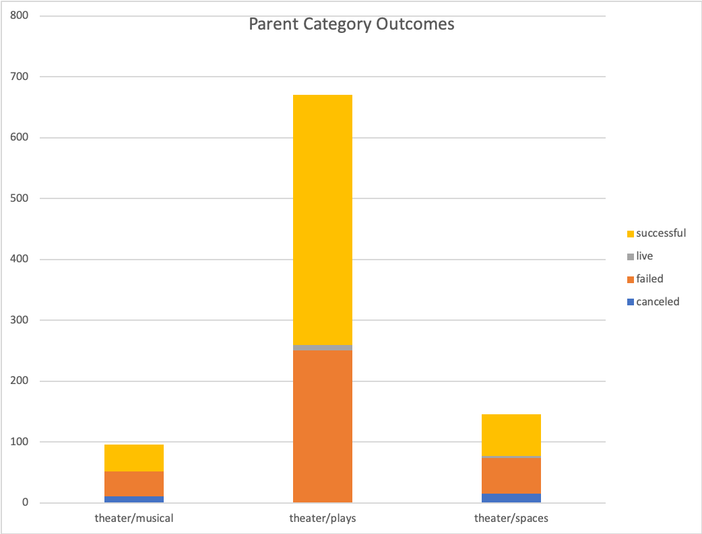
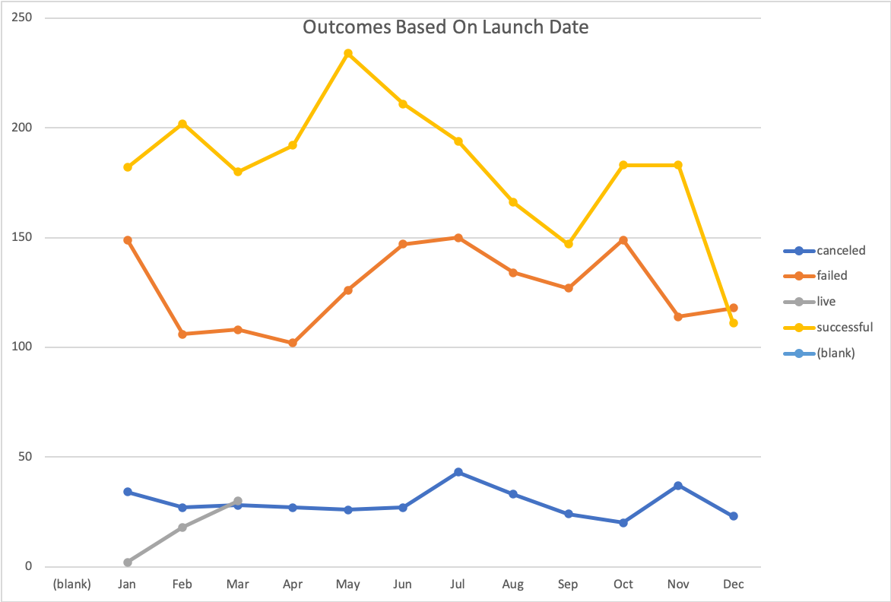
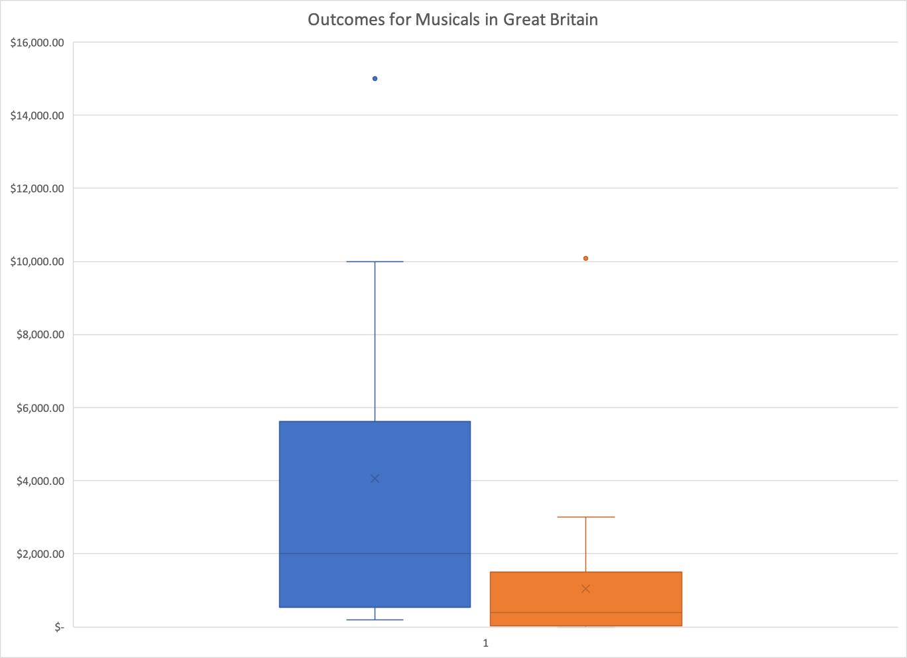

# An Analysis of Kickstarter Campaigns
---
## Project Description
An analysis of Kickstarter campaigns, globally, and specific to the US and Great Britain (GB), was performed to uncover trends. Findings will help create a successful crowdfunding campaign for the release of the play, "Fever", in the US. Findings for five plays from the Edinburgh Fringe Festival and about GB's theater market are also included. The data analysis is available in the Excel document, “data-1-1-3-StarterBook” <[data-1-1-3-StarterBook.xlsx.zip](data-1-1-3-StarterBook.xlsx.zip)>.
---
## Findings
International data was available for 4,114 Kickstarter campaigns, with 3,038 of them from the US. The US had 912 theater campaigns, with the majority of these having been campaigns for plays (671). Plays were the most successful Kickstarter subcategory: the pledge amount reached or exceeded the goal amount in 61% of these campaigns (Figure 1).
---
### Figure 1

---
Successful and failed campaigns for plays showed these differences in trends (see “Descriptive Stats” sheet. Goal amounts for failed campaigns were much higher than for successful campaigns (mean of $10,554 and $5,049, respectively). This has implications for “Fever” since the proposed budget ($12,000) is about 2X the mean goal amount of successful campaigns. For goal amounts, the standard deviation (SD) is 2.7X that of the interquartile range (IQR) for failed campaigns vs. 2.2 for successful campaigns. Thus, it’s likely that there were a couple of failed campaigns with really high goal amounts that skewed the distribution to the right. Also, pledge amounts for failed campaigns were much lower than for successful campaigns (mean of $599 and $5,602, respectively). Since median goal amounts for successful and failed campaigns were similar ($3,000 and $5,000, respectively), there are likely other reasons for low pledge amounts, other than asking for too much money. Finally, Kickstarter campaigns launched in May and June are more successful than those towards the end of the year, with December being the worst month (Figure 2). Campaigns for theater show the same trends.
---
### Figure 2

---
For the five plays of interest from the Edinburgh Fringe Festival, “Be Prepared”, “Checkpoint 22”, “Cutting Off Kate Bush”, “Jestia and Raedon”, and “The Hitchhiker’s Guide to the Family”, findings (fundraising goal and pledge amounts, average donation, and number of backers) are available in sheet “EdinburghResearch”.
---
International data was available for 1,393 Kickstarter theater campaigns, with 26% (359) of them in GB. Of these, 26 campaigns were for musicals. The proposed budget of 4,000 British pounds would be much higher than likely pledge amounts. In fact, it would have been considered an outlier in the dataset. Figure 3 shows that the highest likely pledge amount was about $3,000, which is calculated from the upper quartile plus 1.5X the interquartile range. The upper quartile (75%) of pledge amounts are less than $2,000. 
---
### Figure 3

---
The play “Foresight” from GB was a Kickstarter success and just exceeded its fundraising goal. The average donation ($117.88) was surprisingly high considering it only had 17 backers, and the campaign was only active for less than a month. 
---
## Recommendations
Recommendations are the following: For a crowdfunding campaign for the play, “Fever”, in the US, it is recommended that the goal amount be decreased (ideally closer to $5,000, the mean goal amount of successful campaigns). Also, the campaign is predicted to be more successful if launched in May or June. For crowdfunding campaigns for musicals in GB, it is recommended that the goal amount be decreased (ideally less than $2,000). 
